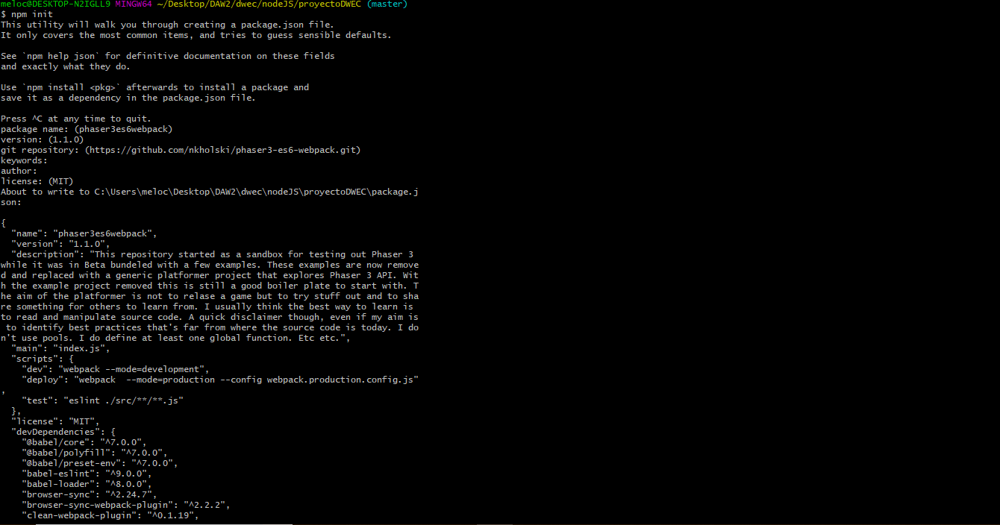
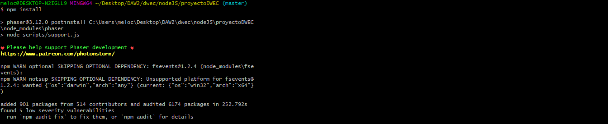
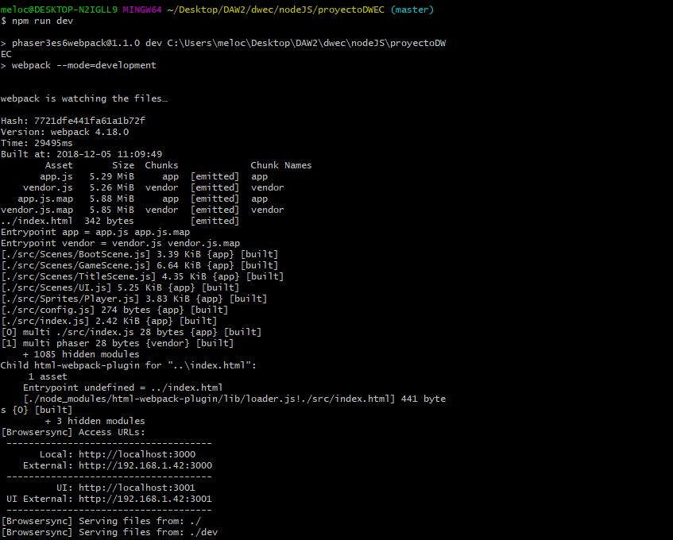
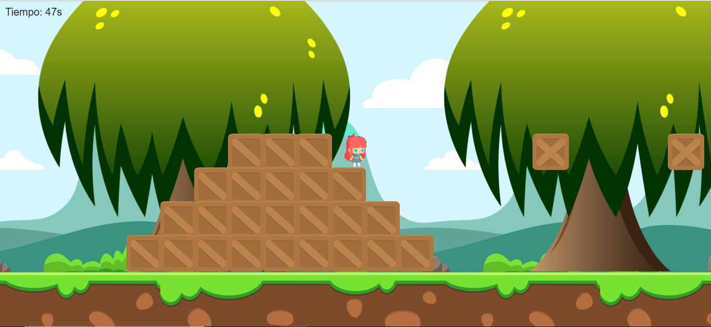
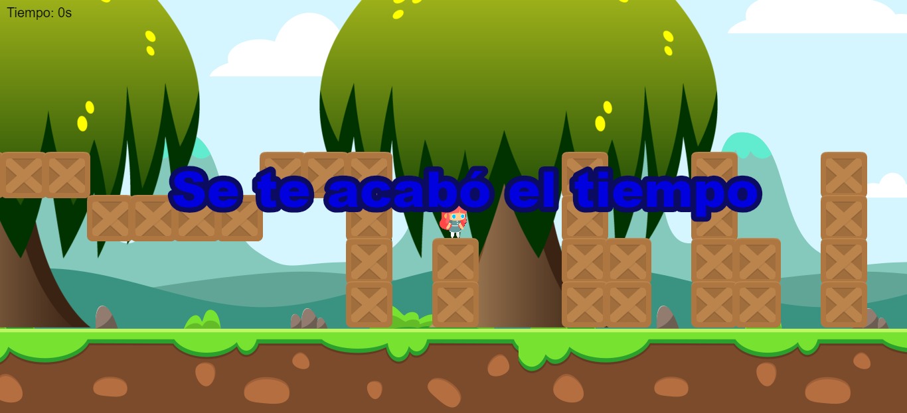
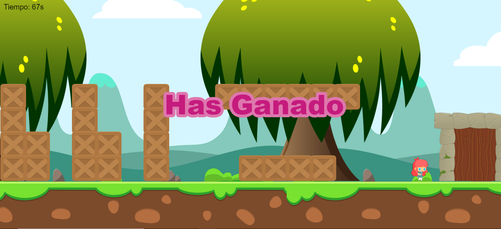

# Phaser game
 
 # ¿COMO INICIO MARILO BRAS?
 
 Abre tu consola y trasladate hacia la carpeta del videojuego. Una vez hecho esto, introduce esta linea.
 
  
 
 Una vez realizado el npm init, realiza un npm install.
 
  
 
 Tras esto, podremos iniciar nuestro juego a través de npm run dev
 
  
 
 
 # ¿CUAL ES EL OBJETIVO DE MARILO BRAS?
 
 El objetivo del juego es llegar al portal antes de que el tiempo se acabe. Si lo consigues, se mostrará un mensaje de victoria, si no, se mostrará un mensaje de derrota.
 
  
 
  
 
  
 
  
 
 
